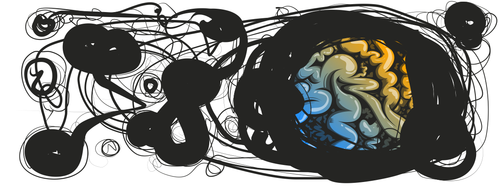
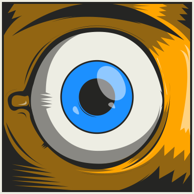

```{r setup, include=FALSE}
knitr::opts_chunk$set(echo = TRUE)
```

## Hello Traveler
You just found [my](https://www.boku.ac.at/personen/person/6E56AD7273C135A3/)
very ephemeral web-presence. I hope to build it up very soon. 
In the mean-time feel free to contact me over at
[twitter](https://twitter.com/ido87).

An about page will also follow soon. Don't worry (yet).

---

## Some Projects

### Open Learning 2017

```{marginfigure}
Season 2 of a project, which was (and is) inspired by [Una Kravets](https://github.com/una/personal-goals). The idea is to share most 
of my learning efforts openly. For fun and glory!
```

[  ](open_learning_2017.html)

### R and COSERO
```{marginfigure}
'rrrcos' and 'viscos' are my take for providing a unified way to guide the 
calibration of the rainfall-runoff model COSERO from 'R'  
```

[  ](viscos/index.html)


